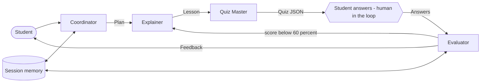

<p align="center"></p>

# Leo: Multi-Agent AI Tutor

**Demo video:** coming soon

I built Leo as a study assistant made of four CrewAI agents that plan, teach, quiz, and coach a student through a topic. Leo runs on Gemini and ships with a Streamlit interface that shows which agent is working at every moment.

## Agents and roles

| Agent | Role | Output |
|---|---|---|
| Coordinator | Validates the request, plans, retries stalled agents, asks for clarification | `Plan` (Pydantic) |
| Explainer | Teaches the plan at the student's level | Markdown lesson |
| Quiz Master | Builds a multiple choice quiz from the lesson | `Quiz` (Pydantic) |
| Evaluator | Grades answers and writes feedback | `Evaluation` (Pydantic) |

Each agent has its own role, goal, backstory, and task template in `leo/prompts.py`.

## Architecture



## Orchestration pattern

I use a sequential process, managed by the Coordinator, and split into two phases because the student must answer between agents. Every handoff is a typed object: the Plan feeds the Explainer, the lesson feeds the Quiz Master, and the quiz JSON feeds the Evaluator. If the Evaluator scores below 60 percent, the weak topics go back to the Explainer for a re-teach and a fresh quiz (feedback loop). The pause for the student is the human-in-the-loop step.

## Requirement checklist

| Requirement | Where I meet it |
|---|---|
| 4 distinct agents, own role, prompt, behaviour | `leo/prompts.py`, `leo/orchestrator.py` |
| CrewAI | `Agent`, `Task`, `Crew` in `leo/orchestrator.py` |
| Real handoffs | Plan, lesson, and Quiz JSON are passed between agents |
| Orchestration pattern | Sequential, Coordinator-managed, two phases |
| Memory and prompt template per role | `leo/memory.py`, `leo/prompts.py` |
| Optional tools | Scoring function; optional RAG knowledge base |
| Graceful problems | Retries, 120 second stall limit, clarification questions |
| Interface showing active agent | Streamlit sidebar pipeline |
| Bonus | Feedback loop and human-in-the-loop quiz step |

## Optional grounded mode (RAG)

From the Module 25 RAG notes, I added an optional knowledge base. I can upload a TXT, MD, or PDF file in the sidebar. Leo splits it into 400 character chunks with 50 overlap, embeds them with Gemini embeddings, stores them in FAISS, and retrieves the top chunks with a metadata filter on the source. The Explainer then teaches only from that material, and the Quiz Master quizzes from the resulting lesson. The Coordinator also uses previous topics to rewrite vague follow-ups such as "tell me more" into a standalone topic (query transformation). Without an upload, Leo behaves exactly as before.

## Other features

- Memory: student name, topics, and score history in `data/memory.json`.
- Tool: deterministic scoring function used before the Evaluator writes feedback.
- Graceful errors: three retries with backoff, then a friendly Coordinator message; unclear requests trigger a clarification question.
- Tests and CI: `pytest` locally and GitHub Actions on every push.
- Docker: `docker build -t leo . && docker run -p 8501:8501 --env-file .env leo`.

## Run

```bash
git clone https://github.com/farjanaferdausi-cs50ai/AI-Leo-Multi-Agent-Tutor.git
cd AI-Leo-Multi-Agent-Tutor
python -m venv .venv && source .venv/Scripts/activate
pip install -r requirements.txt
cp .env.example .env   # add my GEMINI_API_KEY
streamlit run app.py
pytest
```

## Demo script (3 to 5 minutes)

1. Show the sidebar pipeline and enter a topic.
2. Show the Coordinator plan, then the Explainer lesson.
3. Answer the quiz and show the Evaluator feedback.
4. Answer badly on purpose to trigger the re-teach loop.

Author: Farjana Ferdausi
