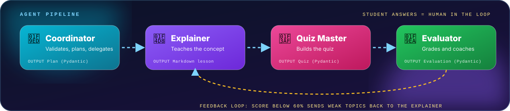
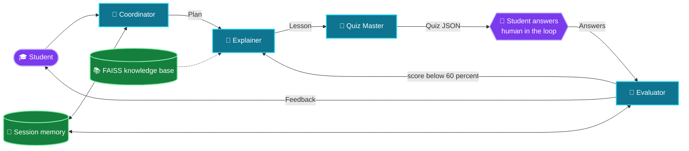

<p align="center">
  
</p>

<p align="center">
  
  
  
  
  
  
  
</p>

<div align="center">

**Demo video:** https://drive.google.com/file/d/1SlFeOE5V49sGy6oD2Kl-J1ZH1145Ow5d/view?usp=sharing

</div>

---

## 📑 Table of Contents

- [Overview](#-overview)
- [Agents and roles](#-agents-and-roles)
- [Architecture](#️-architecture)
- [Orchestration pattern](#-orchestration-pattern)
- [Requirement checklist](#-requirement-checklist)
- [Optional grounded mode (RAG)](#-optional-grounded-mode-rag)
- [Tech stack](#️-tech-stack)
- [Quick start](#-quick-start)
- [Author](#️-author)

---

## ✨ Overview

I built this project as my **Module 26 assignment** (Ostad AI/ML Engineering & Data Science Program). I built **Leo** as a study assistant made of four collaborating agents instead of one bot. A student picks a topic, and Leo's agents plan, teach, quiz, and give feedback, handing typed work to each other at every step. If the score is weak, the Evaluator sends the weak topics back to the Explainer for a re-teach.

<p align="center">
  
</p>

## 🤖 Agents and roles

| Agent | Role | Handoff output |
|---|---|---|
| 🧭 **Coordinator** | Validates the request, plans the lesson, asks for clarification when the request is unclear | `Plan` (Pydantic) |
| 📘 **Explainer** | Teaches the plan at the student's level with an analogy and a mini example | Markdown lesson |
| 🎯 **Quiz Master** | Builds a multiple choice quiz from the lesson | `Quiz` (Pydantic) |
| 🧪 **Evaluator** | Grades the answers and writes feedback and weak topics | `Evaluation` (Pydantic) |

Each agent has its own role, goal, backstory, and task template in `leo/prompts.py`.

## 🏗️ Architecture



## 🔁 Orchestration pattern

I use a **sequential** process that starts with the Coordinator agent. A small orchestrator layer in code carries each typed output to the next agent and retries stalled ones. The run is split into two phases because the student must answer between agents.

1. **Phase 1:** Coordinator, then Explainer, then Quiz Master.
2. **Pause:** the student answers in the Streamlit interface. This is the human-in-the-loop step, and the student can also steer the Explainer with a note before the quiz.
3. **Phase 2:** Evaluator grades the answers. Below 60 percent, the weak topics go back to the Explainer for a re-teach and a fresh quiz (feedback loop).

Every handoff is explicit: the Coordinator's typed `Plan` feeds the Explainer, the lesson reaches the Quiz Master through CrewAI task context inside one sequential Crew, and the typed Quiz JSON feeds the Evaluator in phase 2.

## ✅ Requirement checklist

| Requirement | Where I meet it |
|---|---|
| 4 distinct agents, own role, prompt, behaviour | `leo/prompts.py`, `leo/orchestrator.py` |
| CrewAI | `Agent`, `Task`, `Crew` in `leo/orchestrator.py` |
| Real handoffs | Plan, lesson, and Quiz JSON are passed between agents |
| Orchestration pattern | Sequential, Coordinator first, two phases |
| Memory and prompt template per role | `leo/memory.py`, `leo/prompts.py` |
| Optional tools | Deterministic scoring function and optional RAG knowledge base |
| Graceful problems | Orchestrator retries with backoff, 120 second stall limit, quota message, Coordinator clarification questions |
| Interface showing the active agent | Streamlit pipeline cards and handoff log |
| Bonus | Feedback loop and human-in-the-loop quiz step |

## 🧠 Optional grounded mode (RAG)

I can upload a TXT, MD, or PDF file in the sidebar. Leo splits it into 400 character chunks with 50 overlap, embeds them with Gemini embeddings, stores them in FAISS, and retrieves the top chunks with a metadata filter on the source. The Explainer then teaches only from that material. The Coordinator also uses previous topics to rewrite vague follow-ups such as "tell me more" into a standalone topic. Without an upload, Leo behaves exactly as before.

## 🛠️ Tech stack

| Layer | Choice |
|---|---|
| Agents | CrewAI |
| LLM | Gemini (`gemini-3.5-flash`, with a faster model for the Coordinator) |
| Structured output | Pydantic |
| Retrieval | FAISS and Gemini embeddings |
| Interface | Streamlit with a glassmorphism theme and a green mode |
| Quality | pytest, GitHub Actions CI, Docker |

## 🚀 Quick start

```bash
git clone https://github.com/farjanaferdausi-cs50ai/AI-Leo-Multi-Agent-Tutor.git
cd AI-Leo-Multi-Agent-Tutor
python -m venv .venv
source .venv/Scripts/activate        # Windows Git Bash
python -m pip install -r requirements.txt
cp .env.example .env                 # then add my GEMINI_API_KEY
python -m streamlit run app.py
python -m pytest -q
```

Docker: `docker build -t leo . && docker run -p 8501:8501 --env-file .env leo`

## 🗂️ Project structure

```text
app.py                  Streamlit interface
leo/orchestrator.py     Agents, tasks, retries, handoffs
leo/prompts.py          Role and task templates
leo/schemas.py          Pydantic contracts
leo/memory.py           Student memory
leo/knowledge.py        Optional FAISS RAG
tests/                  Unit tests
assets/                 Logo, banner, pipeline
```

## 🎬 Demo script (3 to 5 minutes)

1. Show the interface and the four agents.
2. Enter a topic and show each agent turn and the handoff log.
3. Answer the quiz and show the Evaluator feedback.
4. Answer badly on purpose to trigger the re-teach loop.
5. Steer the Explainer with a note before the quiz.

---

## 🖊️ Author

**Farjana Ferdausi**

AI/ML Engineering & Data Science, Fellow of Google Cloud Gen AI Academy APAC Edition (Cohort 3) | Agentic AI · RAG · Gemini · CrewAI

[GitHub](https://github.com/farjanaferdausi-cs50ai) · [LinkedIn](https://www.linkedin.com/in/farjana-ferdausi/) · [Medium](https://medium.com/@farjana.rafi1983)
